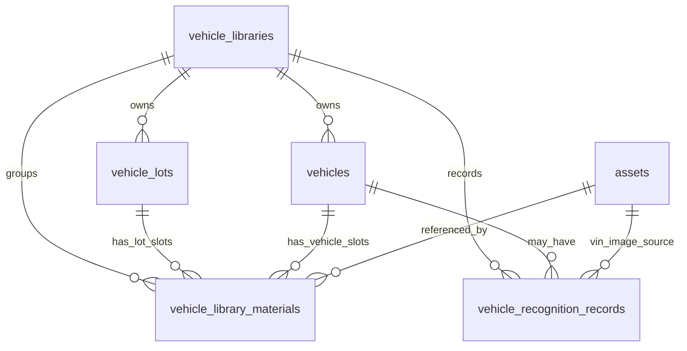

# Vehicle Library Database Design Document

Status: implemented
Date: 2026-07-03
Branch: `test`

## 1. Purpose

The Vehicle Library stores reusable car and lot information for usedCarPlatform. A user or enterprise team can save vehicle profile fields, VIN information, vehicle images, vehicle videos, and lot/dealership assets once, then reuse those records in later generation workflows instead of uploading the same information every time.

This design covers the database and API foundation only. It intentionally excludes generation-project persistence from the source sections 6 and 7.

## 2. Scope

In scope:

- Per-account (`owner_user_id`) vehicle libraries; enterprise `tenant_id` is affiliation metadata only, not a shared data scope.
- Lot/dealership records.
- Vehicle records.
- Fixed material slots for vehicle and lot media.
- Material records that reference the existing `assets` table.
- VIN text and VIN image recognition records.
- Completeness tracking for vehicles and lots.

Out of scope:

- `vehicle_video_projects`.
- `vehicle_video_project_materials`.
- Digital human, template, voice, output ratio, and generation-result snapshots.
- Vehicle valuation, sales leads, finance, inventory accounting, and complex approval flows.
- Replacing the existing `assets` upload/storage table.

## 3. Design Principles

- Reuse existing file storage. File binaries, local paths, public URLs, thumbnails, MIME types, and dimensions stay in `assets`.
- Keep vehicle-library tables business-focused. They store ownership, vehicle fields, slot mapping, status, and recognition metadata.
- Enforce ownership in application code before writes. The first phase keeps DB indexes and avoids hard foreign keys to reduce migration risk against existing local data.
- Use fixed slots for predictable frontend and generation consumption.
- Keep generation integration loosely coupled. The vehicle row has `last_generated_at` for future reporting, but no project tables are created.
- Prefer soft deletion for business records.

## 4. Entity Relationship Overview



Logical hierarchy:

```text
vehicle_libraries
+-- vehicle_lots
|   +-- vehicle_library_materials (owner_type = lot)
+-- vehicles
|   +-- vehicle_library_materials (owner_type = vehicle)
+-- vehicle_recognition_records
```

## 5. Ownership And Access Model

The backend derives scope from the authenticated user session:

- **All accounts (personal and enterprise) are isolated by `owner_user_id = current.user.id`.** Each account can only access libraries it owns.
- `tenant_id` records enterprise affiliation (billing, reporting, audit) but **does not widen data access**. Users in the same enterprise cannot see each other's vehicles, lots, or materials.

The service creates or returns the **current account's** default active library when `/api/v1/vehicle-library/me` is called (default library ID is derived from `user.id`, not shared per tenant).

Access rules:

- All vehicle-library APIs require login.
- A caller can only access libraries where `owner_user_id` matches the current user.
- Vehicle, lot, material, and recognition operations must resolve through an accessible library first.
- `asset_id` links require `assets.user_id = current.user.id`.
- A vehicle `lot_id` must belong to the same `library_id`.

## 6. Table Design

### 6.1 `vehicle_libraries`

Purpose: top-level vehicle-library workspace.

Important columns:

| Column | Meaning |
| --- | --- |
| `id` | Application-generated primary key. |
| `tenant_id` | Optional enterprise tenant marker (null for personal users); used for affiliation and reporting, not cross-account data sharing. |
| `owner_user_id` | Owning account; **primary isolation dimension**. |
| `name` | Display name. Defaults to `Vehicle Library`. |
| `status` | `active`, `frozen`, `disabled`. |
| `quota_bytes` | Capacity limit. `0` means unlimited. |
| `used_bytes` | Sum of active linked material sizes. |
| `remark` | Optional note. |

Indexes:

- `idx_vehicle_libraries_tenant (tenant_id)`
- `idx_vehicle_libraries_owner (owner_user_id)`
- `idx_vehicle_libraries_status (status)`

### 6.2 `vehicle_lots`

Purpose: saved lot/dealership profile.

Important columns:

| Column | Meaning |
| --- | --- |
| `id` | Application-generated primary key. |
| `library_id` | Owning vehicle library. |
| `name` | Lot or dealership name. |
| `address` | Optional address. |
| `material_status` | `incomplete` or `complete`. |
| `status` | `active` or `archived`. |
| `deleted_at` | Soft delete marker. |

Indexes:

- `idx_vehicle_lots_library_status (library_id, status)`
- `idx_vehicle_lots_material_status (library_id, material_status)`
- `idx_vehicle_lots_created_at (created_at)`

### 6.3 `vehicles`

Purpose: reusable car profile and inventory-like status.

Important columns:

| Column | Meaning |
| --- | --- |
| `id` | Application-generated primary key. |
| `library_id` | Owning vehicle library. |
| `lot_id` | Optional lot/dealership association. |
| `vin` | Optional normalized VIN. |
| `identify_type` | `manual`, `vin_text`, `vin_image`. |
| `brand`, `series` | Required vehicle identity fields. |
| `model`, `model_year`, `energy_type`, `displacement`, `transmission`, `vehicle_level`, `color` | Optional vehicle attributes. |
| `mileage_km`, `first_registration_date`, `guide_price`, `sale_price` | Optional market and listing data. |
| `material_status` | `incomplete` or `complete`. |
| `status` | `active`, `sold`, `archived`. |
| `last_generated_at` | Future reporting hook for generation usage. |
| `deleted_at` | Soft delete marker. |

Indexes:

- `uk_vehicles_library_vin (library_id, vin)`
- `idx_vehicles_library_status (library_id, status)`
- `idx_vehicles_lot (lot_id)`
- `idx_vehicles_brand_series (library_id, brand, series)`
- `idx_vehicles_material_status (library_id, material_status)`
- `idx_vehicles_created_at (created_at)`

VIN rule:

- VIN is optional.
- Non-empty VIN values are trimmed, uppercased, and validated as 17 characters excluding `I`, `O`, and `Q`.
- VIN uniqueness is enforced inside a library.
- MySQL allows multiple `NULL` values in `uk_vehicles_library_vin`, so manual vehicles without VIN can coexist.

### 6.4 `vehicle_library_materials`

Purpose: maps existing uploaded assets into fixed vehicle or lot slots.

Important columns:

| Column | Meaning |
| --- | --- |
| `library_id` | Owning vehicle library. |
| `owner_type` | `vehicle` or `lot`. |
| `owner_id` | Vehicle ID or lot ID. |
| `asset_id` | Existing `assets.id`. |
| `slot_code` | Fixed slot code. |
| `media_type` | `image` or `video`. |
| `file_name`, `file_size`, `width`, `height` | Display/cache metadata copied from `assets`. |
| `is_required`, `is_cover`, `sort_order` | Slot-definition metadata. |
| `status` | `active`, `processing`, `failed`, `deleted`. |
| `audit_status` | `pending`, `passed`, `rejected`. |
| `metadata_json` | Optional extension payload. |
| `deleted_at` | Soft delete marker. |

Indexes:

- `uk_vehicle_library_material_slot (owner_type, owner_id, slot_code)`
- `idx_vehicle_library_materials_library (library_id)`
- `idx_vehicle_library_materials_owner (owner_type, owner_id)`
- `idx_vehicle_library_materials_asset (asset_id)`
- `idx_vehicle_library_materials_status (status, audit_status)`

Slot replacement:

- The unique slot key means each owner can have only one row per slot.
- Replacing a slot updates the existing logical slot through `ON DUPLICATE KEY UPDATE`.

### 6.5 `vehicle_recognition_records`

Purpose: stores VIN recognition attempts and provider results.

Important columns:

| Column | Meaning |
| --- | --- |
| `library_id` | Owning vehicle library. |
| `vehicle_id` | Optional linked vehicle. |
| `recognition_type` | `vin_text` or `vin_image`. |
| `input_vin` | Raw VIN input for text recognition. |
| `source_asset_id` | VIN image asset for image recognition. |
| `recognized_vin` | Normalized VIN result. |
| `provider_code` | Provider identifier. |
| `confidence` | Optional recognition confidence. |
| `status` | `pending`, `success`, `failed`. |
| `result_json` | Raw or normalized provider payload. |
| `error_code`, `error_message` | Failure details. |

Indexes:

- `idx_vehicle_recognition_library (library_id, created_at)`
- `idx_vehicle_recognition_vehicle (vehicle_id)`
- `idx_vehicle_recognition_vin (recognized_vin)`
- `idx_vehicle_recognition_status (status)`

## 7. Fixed Material Slots

Vehicle slots:

| Slot | Media | Required | Cover | Sort |
| --- | --- | --- | --- | --- |
| `front_image` | image | yes | yes | 10 |
| `rear_image` | image | yes | no | 20 |
| `driver_image` | image | yes | no | 30 |
| `front_row_video` | video | yes | no | 40 |
| `rear_row_video` | video | yes | no | 50 |

Lot slots:

| Slot | Media | Required | Cover | Sort |
| --- | --- | --- | --- | --- |
| `lot_image` | image | yes | yes | 10 |
| `lot_video` | video | yes | no | 20 |

Completeness:

- A vehicle is `complete` when all 5 vehicle slots have active, non-deleted, non-rejected material rows.
- A lot is `complete` when both lot slots have active, non-deleted, non-rejected material rows.
- Removing a required slot returns the owner to `incomplete`.

## 8. API Surface

Base path:

```text
/api/v1/vehicle-library
```

Implemented endpoints:

```text
GET    /me
POST   /libraries
PATCH  /libraries/:libraryId

GET    /lots
POST   /lots
GET    /lots/:lotId
PATCH  /lots/:lotId
DELETE /lots/:lotId
PUT    /lots/:lotId/materials/:slotCode
DELETE /lots/:lotId/materials/:slotCode

GET    /vehicles
POST   /vehicles
GET    /vehicles/:vehicleId
PATCH  /vehicles/:vehicleId
DELETE /vehicles/:vehicleId
PUT    /vehicles/:vehicleId/materials/:slotCode
DELETE /vehicles/:vehicleId/materials/:slotCode

POST   /recognition/vin-text
POST   /recognition/vin-image
GET    /recognition-records
```

All responses use the existing envelope:

```ts
interface ApiResponse<T> {
  code: number;
  message: string;
  data: T;
  requestId: string;
}
```

## 9. Validation Rules

- `brand` and `series` are required for vehicle creation.
- VIN must be valid if present.
- Calendar dates must be strict `YYYY-MM-DD` dates.
- Prices, mileage, quota, and sizes must be non-negative.
- Slot code must match owner type.
- Image slots require image MIME types.
- Video slots require video MIME types.
- Material deletion requires the owner vehicle or lot to exist.
- Duplicate VIN inside one library returns conflict.

## 10. Migration Strategy

The tables are added to `backend/src/db/migrations.ts` as idempotent `CREATE TABLE IF NOT EXISTS` statements. This matches the current backend migration runner.

The migration was verified by running:

```bash
cd backend
npm run migrate
npm run migrate
```

The schema assertion confirmed only these vehicle-library tables exist:

- `vehicle_libraries`
- `vehicle_lots`
- `vehicles`
- `vehicle_library_materials`
- `vehicle_recognition_records`

## 11. Verification Coverage

Automated and smoke checks cover:

- Backend typecheck.
- Frontend typecheck.
- Contract tests for VIN, strict dates, slots, ownership SQL, completeness query, and owner table updates.
- Real MySQL migration.
- In-process Express API smoke for auth, library home, lot material completeness, vehicle material completeness, VIN recognition, duplicate VIN, bad VIN, wrong media type, patch, delete, and cleanup.

Known startup caveat:

- `backend npm run dev` still tries to sync the external Credits Platform at `127.0.0.1:3000`. The vehicle-library routes were therefore tested through the Express app directly to avoid that unrelated dependency.

## 12. Future Work

- Add frontend management UI for saved vehicles and lots.
- Add vehicle picker/prefill into video-generation and workspace forms.
- Add provider-backed VIN image recognition.
- Add optional foreign keys after production data quality is confirmed.
- Add admin reporting around library storage usage.
- Add a future generation snapshot model only if section 6/7 scope becomes required again.
