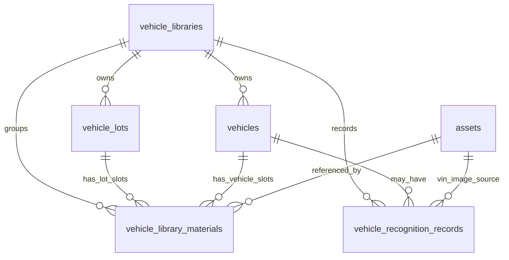

# 车辆素材库数据库设计文档

状态：已实现
日期：2026-07-03
分支：`test`

## 1. 设计目标

车辆素材库用于在 usedCarPlatform 中沉淀可复用的车辆与车场信息。用户或企业团队可以一次性保存车辆基础字段、VIN 信息、车辆图片、车辆视频、车场图片和车场视频，后续在生成工作流中复用这些资料，避免每次都重新上传 VIN、车辆图片和素材。

本设计只覆盖数据库和 API 基础能力，不包含来源文档第 6、7 部分的视频生成项目持久化。

## 2. 范围

本期包含：

- 按账号（`owner_user_id`）隔离的车辆素材库；企业 `tenant_id` 仅作归属标记，不跨账号共享数据。
- 车场/门店记录。
- 车辆记录。
- 车辆与车场的固定素材槽位。
- 复用现有 `assets` 表的素材关联记录。
- VIN 文本识别和 VIN 图片识别记录。
- 车辆和车场素材完整度状态。

本期不包含：

- `vehicle_video_projects`。
- `vehicle_video_project_materials`。
- 数字人、模板、声音、输出比例和生成结果快照。
- 车辆估值、销售线索、库存财务、销售财务和复杂审批流程。
- 替换现有 `assets` 上传和存储表。

## 3. 设计原则

- 复用现有文件存储。文件本体、本地路径、公开 URL、缩略图、MIME 类型和尺寸仍由 `assets` 表负责。
- 车辆素材库表只保存业务关系。它们负责所有权、车辆字段、素材槽位、状态和识别元数据。
- 写入前由应用层校验权限和归属。一期先保留索引，不强制增加外键，降低对已有本地数据的迁移风险。
- 固定素材槽位，方便前端表单、列表和后续生成链路稳定消费。
- 与生成链路保持松耦合。`vehicles.last_generated_at` 作为后续统计钩子保留，但本期不建立视频生成项目表。
- 业务记录默认软删除。

## 4. 实体关系



逻辑层级：

```text
vehicle_libraries 车辆素材库
+-- vehicle_lots 车场
|   +-- vehicle_library_materials 车场素材槽位
+-- vehicles 车辆
|   +-- vehicle_library_materials 车辆素材槽位
+-- vehicle_recognition_records VIN识别记录
```

## 5. 权限与归属模型

后端从当前登录用户会话推导数据范围：

- **所有账号（个人 / 企业）统一按 `owner_user_id = current.user.id` 隔离**，每个账号只能访问自己创建或开通的素材库。
- `tenant_id` 仅记录企业归属（套餐、统计、审计），**不参与数据可见范围**；同企业下不同账号互不可见对方的车辆、车场与素材。

前端首次调用 `/api/v1/vehicle-library/me` 时，服务会创建或返回**当前登录账号**的默认启用素材库（默认库 ID 由 `user.id` 派生，不按租户共享）。

访问规则：

- 所有车辆素材库接口都必须登录。
- 调用方只能访问 `owner_user_id` 等于当前用户的素材库。
- 车辆、车场、素材和识别记录都必须先通过可访问的 `library_id` 解析。
- 关联 `asset_id` 前必须确认 `assets.user_id = current.user.id`。
- 车辆的 `lot_id` 必须属于同一个 `library_id`。

## 6. 表设计

### 6.1 `vehicle_libraries`

用途：车辆素材库顶层空间。

关键字段：

| 字段 | 含义 |
| --- | --- |
| `id` | 应用层生成的主键。 |
| `tenant_id` | 可选企业租户标记（个人用户为空）；用于归属与统计，不用于跨账号数据共享。 |
| `owner_user_id` | 素材库所属账号；**数据隔离的主键维度**。 |
| `name` | 展示名称，默认 `Vehicle Library`。 |
| `status` | `active`、`frozen`、`disabled`。 |
| `quota_bytes` | 容量上限，`0` 表示不限制。 |
| `used_bytes` | 当前有效素材文件大小累计。 |
| `remark` | 备注。 |

索引：

- `idx_vehicle_libraries_tenant (tenant_id)`
- `idx_vehicle_libraries_owner (owner_user_id)`
- `idx_vehicle_libraries_status (status)`

### 6.2 `vehicle_lots`

用途：保存车场、门店或展厅信息。

关键字段：

| 字段 | 含义 |
| --- | --- |
| `id` | 应用层生成的主键。 |
| `library_id` | 所属车辆素材库。 |
| `name` | 车场或门店名称。 |
| `address` | 可选地址。 |
| `material_status` | `incomplete` 或 `complete`。 |
| `status` | `active` 或 `archived`。 |
| `deleted_at` | 软删除时间。 |

索引：

- `idx_vehicle_lots_library_status (library_id, status)`
- `idx_vehicle_lots_material_status (library_id, material_status)`
- `idx_vehicle_lots_created_at (created_at)`

### 6.3 `vehicles`

用途：保存可复用车辆资料和类似库存的状态。

关键字段：

| 字段 | 含义 |
| --- | --- |
| `id` | 应用层生成的主键。 |
| `library_id` | 所属车辆素材库。 |
| `lot_id` | 可选车场关联。 |
| `vin` | 可选 VIN，保存为规范化大写。 |
| `identify_type` | `manual`、`vin_text`、`vin_image`。 |
| `brand`、`series` | 必填车辆身份字段。 |
| `model`、`model_year`、`energy_type`、`displacement`、`transmission`、`vehicle_level`、`color` | 可选车辆属性。 |
| `mileage_km`、`first_registration_date`、`guide_price`、`sale_price` | 可选里程、日期和价格字段。 |
| `material_status` | `incomplete` 或 `complete`。 |
| `status` | `active`、`sold`、`archived`。 |
| `last_generated_at` | 后续统计生成使用情况的预留字段。 |
| `deleted_at` | 软删除时间。 |

索引：

- `uk_vehicles_library_vin (library_id, vin)`
- `idx_vehicles_library_status (library_id, status)`
- `idx_vehicles_lot (lot_id)`
- `idx_vehicles_brand_series (library_id, brand, series)`
- `idx_vehicles_material_status (library_id, material_status)`
- `idx_vehicles_created_at (created_at)`

VIN 规则：

- VIN 可为空。
- 非空 VIN 会先去除空格、转成大写，并校验为 17 位且不能包含 `I`、`O`、`Q`。
- 同一个素材库内非空 VIN 唯一。
- MySQL 唯一索引允许多个 `NULL`，因此手动录入且没有 VIN 的车辆可以共存。

### 6.4 `vehicle_library_materials`

用途：把现有上传素材映射到车辆或车场的固定槽位。

关键字段：

| 字段 | 含义 |
| --- | --- |
| `library_id` | 所属车辆素材库。 |
| `owner_type` | `vehicle` 或 `lot`。 |
| `owner_id` | 车辆 ID 或车场 ID。 |
| `asset_id` | 现有 `assets.id`。 |
| `slot_code` | 固定槽位编码。 |
| `media_type` | `image` 或 `video`。 |
| `file_name`、`file_size`、`width`、`height` | 从 `assets` 冗余的展示字段。 |
| `is_required`、`is_cover`、`sort_order` | 槽位定义元数据。 |
| `status` | `active`、`processing`、`failed`、`deleted`。 |
| `audit_status` | `pending`、`passed`、`rejected`。 |
| `metadata_json` | 扩展信息。 |
| `deleted_at` | 软删除时间。 |

索引：

- `uk_vehicle_library_material_slot (owner_type, owner_id, slot_code)`
- `idx_vehicle_library_materials_library (library_id)`
- `idx_vehicle_library_materials_owner (owner_type, owner_id)`
- `idx_vehicle_library_materials_asset (asset_id)`
- `idx_vehicle_library_materials_status (status, audit_status)`

槽位替换规则：

- 唯一索引保证每个归属对象的每个槽位只有一条逻辑记录。
- 替换槽位时通过 `ON DUPLICATE KEY UPDATE` 更新原槽位，而不是插入第二条。

### 6.5 `vehicle_recognition_records`

用途：保存 VIN 识别请求、结果和错误信息。

关键字段：

| 字段 | 含义 |
| --- | --- |
| `library_id` | 所属车辆素材库。 |
| `vehicle_id` | 可选关联车辆。 |
| `recognition_type` | `vin_text` 或 `vin_image`。 |
| `input_vin` | VIN 文本识别的原始输入。 |
| `source_asset_id` | VIN 图片识别的图片素材。 |
| `recognized_vin` | 识别后的规范 VIN。 |
| `provider_code` | 识别服务商编码。 |
| `confidence` | 可选置信度。 |
| `status` | `pending`、`success`、`failed`。 |
| `result_json` | 原始或规范化返回内容。 |
| `error_code`、`error_message` | 失败信息。 |

索引：

- `idx_vehicle_recognition_library (library_id, created_at)`
- `idx_vehicle_recognition_vehicle (vehicle_id)`
- `idx_vehicle_recognition_vin (recognized_vin)`
- `idx_vehicle_recognition_status (status)`

## 7. 固定素材槽位

车辆素材：

| 槽位 | 媒体 | 必传 | 封面 | 排序 |
| --- | --- | --- | --- | --- |
| `front_image` | 图片 | 是 | 是 | 10 |
| `rear_image` | 图片 | 是 | 否 | 20 |
| `driver_image` | 图片 | 是 | 否 | 30 |
| `front_row_video` | 视频 | 是 | 否 | 40 |
| `rear_row_video` | 视频 | 是 | 否 | 50 |

车场素材：

| 槽位 | 媒体 | 必传 | 封面 | 排序 |
| --- | --- | --- | --- | --- |
| `lot_image` | 图片 | 是 | 是 | 10 |
| `lot_video` | 视频 | 是 | 否 | 20 |

完整度规则：

- 车辆 5 个必传槽位都存在有效、未删除、未驳回素材时，车辆为 `complete`。
- 车场 2 个必传槽位都存在有效、未删除、未驳回素材时，车场为 `complete`。
- 删除任意必传槽位后，归属对象回到 `incomplete`。

## 8. API 范围

基础路径：

```text
/api/v1/vehicle-library
```

已实现接口：

```text
GET    /me
POST   /libraries
PATCH  /libraries/:libraryId

GET    /lots
POST   /lots
GET    /lots/:lotId
PATCH  /lots/:lotId
DELETE /lots/:lotId
PUT    /lots/:lotId/materials/:slotCode
DELETE /lots/:lotId/materials/:slotCode

GET    /vehicles
GET    /vehicles/query?vin=&brand=&modelYear=&model=&page=&pageSize=
POST   /vehicles
GET    /vehicles/:vehicleId
PATCH  /vehicles/:vehicleId
DELETE /vehicles/:vehicleId
PUT    /vehicles/:vehicleId/materials/:slotCode
DELETE /vehicles/:vehicleId/materials/:slotCode

POST   /recognition/vin-text
POST   /recognition/vin-image
GET    /recognition-records
```

统一响应结构沿用现有后端：

```ts
interface ApiResponse<T> {
  code: number;
  message: string;
  data: T;
  requestId: string;
}
```

## 9. 校验规则

- 创建车辆时 `brand` 和 `series` 必填。
- VIN 非空时必须合法。
- 日期必须是严格的 `YYYY-MM-DD` 日历日期。
- 价格、里程、容量和文件大小必须为非负数。
- 槽位编码必须匹配归属类型。
- 图片槽位必须关联图片 MIME 类型素材。
- 视频槽位必须关联视频 MIME 类型素材。
- 删除素材槽位前必须确认对应车辆或车场存在。
- 同一素材库内重复 VIN 返回冲突错误。

## 10. 迁移策略

车辆素材库表已通过 `backend/src/db/migrations.ts` 中的 `CREATE TABLE IF NOT EXISTS` 语句接入现有 MySQL 迁移方式。

验证命令：

```bash
cd backend
npm run migrate
npm run migrate
```

Schema 校验确认只创建了以下 5 张表：

- `vehicle_libraries`
- `vehicle_lots`
- `vehicles`
- `vehicle_library_materials`
- `vehicle_recognition_records`

## 11. 验证覆盖

已验证内容：

- 后端 TypeScript 类型检查。
- 前端 TypeScript/Vue 类型检查。
- VIN、严格日期、素材槽位、归属 SQL、完整度查询和归属表更新的契约测试。
- 真实 MySQL 迁移。
- 通过 Express 应用实例完成 API 冒烟测试，覆盖鉴权、素材库首页、车场素材完整度、车辆素材完整度、VIN 识别、重复 VIN、非法 VIN、错误媒体类型、更新、删除和测试数据清理。

已知启动说明：

- `backend npm run dev` 当前仍会尝试同步 `127.0.0.1:3000` 的外部 Credits Platform。车辆素材库接口测试通过直接启动 Express 应用实例完成，避免该无关依赖影响测试结果。

## 12. 后续工作

- 增加车辆和车场管理前端页面。
- 将保存车辆选择和预填能力接入视频生成和工作台表单。
- 接入真实 VIN 图片识别服务商。
- 生产数据质量确认后再考虑增加数据库外键。
- 增加素材库容量和使用量的后台统计。
- 只有当第 6、7 部分范围重新进入需求时，才新增生成项目快照模型。
